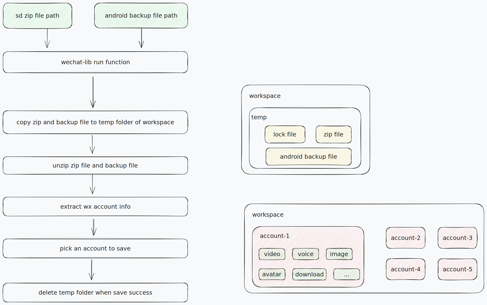
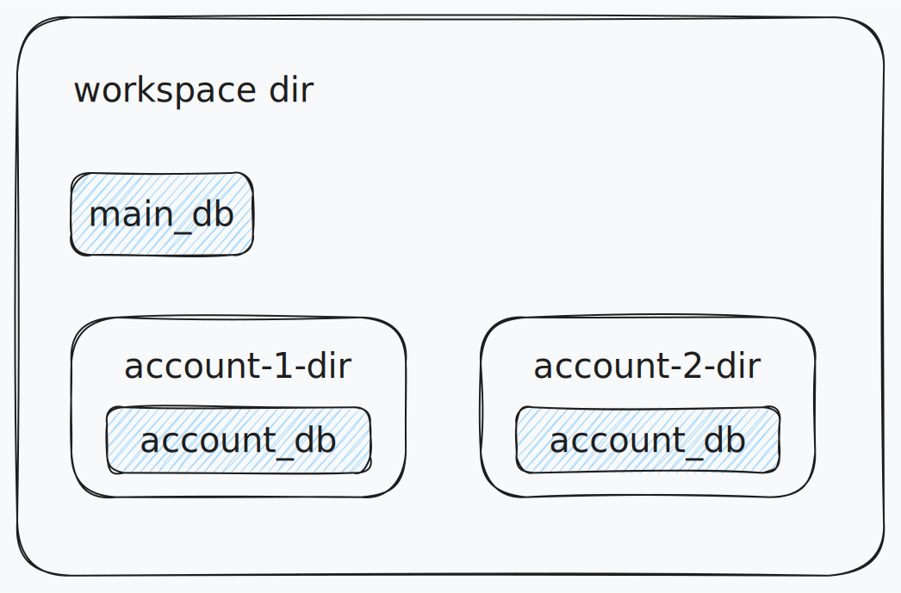
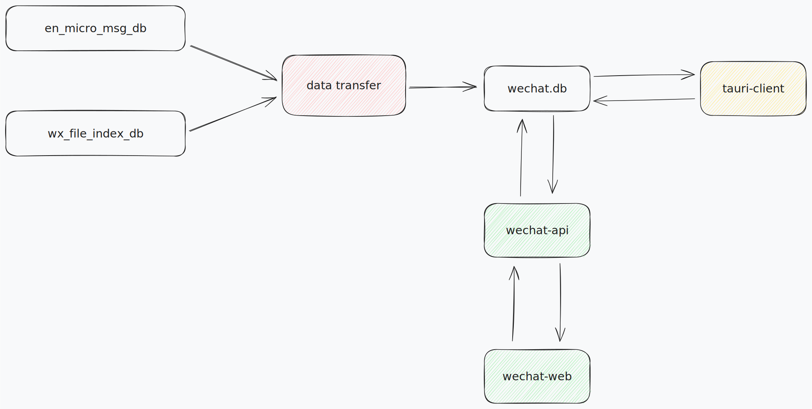

# WeChatSaver


## Dependencies
- FFmpeg
- sqlcipher
 - 编译的时候，要加上环境变量`RUSTFLAGS="-L /opt/homebrew/opt/sqlcipher/lib"`
```shell
# 依赖
rusqlite = {version = "0.32.1",features = ["sqlcipher"]}
# 编译的时候，要加上环境变量
 export RUSTFLAGS="-L /opt/homebrew/opt/sqlcipher/lib"
```

## Process Flow







## module

- **wechat-saver-lib**: 只进行本地io相关操作，不涉及网络相关操作
- **wechat-api**: 提供http api接口，提供文件上传的接口。处理逻辑使用`wechat-saver-lib`模块
- **wechat-web**: web页面
  
## TODO

- [ ] optimize unit test
- [ ] send progress data of file extract 